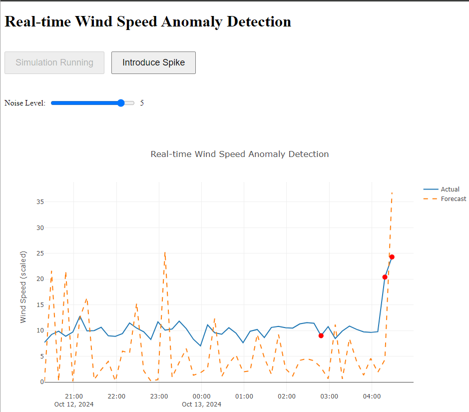

# Wind Speed Anomaly Detection

This project implements a real-time wind speed anomaly detection system using machine learning and adaptive algorithms. It provides a web-based interface for visualizing wind speed data and detecting anomalies as they occur.

## Table of Contents
1. [Overview](#overview)
2. [Installation](#installation)
3. [Usage](#usage)
4. [Key Components](#key-components)
5. [Algorithm Explanation](#algorithm-explanation)
6. [File Structure](#file-structure)

## Overview

This application uses a combination of LSTM (Long Short-Term Memory) neural networks and adaptive exponential smoothing to predict wind speeds and detect anomalies in real-time. It offers an interactive web interface where users can adjust parameters such as noise levels and detection window sizes to experiment with the anomaly detection process.

## Installation

1. Clone this repository:
   ```
   git clone https://github.com/yourusername/wind-speed-anomaly-detection.git
   cd wind-speed-anomaly-detection
   ```

2. Create a virtual environment and activate it:
   ```
   python -m venv venv
   source venv/bin/activate  # On Windows, use `venv\Scripts\activate`
   ```

3. Install the required packages:
   ```
   pip install -r requirements.txt
   ```

## Usage

1. Run the Flask application:
   ```
   python app.py
   ```

2. Open a web browser and navigate to `http://localhost:5000`.

3. Use the interface to start the simulation, adjust noise levels, and introduce spikes in the data.

## Key Components

### 1. LSTM Model (`models.py`)
- Implements a neural network using LSTM layers for wind speed prediction.
- Handles model creation, training, and loading of pre-trained weights.

### 2. Anomaly Detection (`anomaly_detection.py`)
- Implements the `RealtimeAdaptiveExponentialSmoothing` class for anomaly detection.
- Uses adaptive thresholds and exponential smoothing to identify anomalies in the wind speed data.

### 3. Data Generation (`data_generation.py`)
- Simulates wind speed data with configurable noise levels and the ability to introduce artificial spikes.

### 4. Flask Application (`app.py`)
- Sets up the web server and WebSocket communication.
- Manages the real-time data flow and updates to the client.

### 5. Front-end Visualization (`templates/index.html`)
- Provides an interactive interface for data visualization and parameter adjustment.
- Uses Plotly for real-time charting of wind speed data and anomalies.

## Algorithm Explanation

The anomaly detection system in this project uses a two-pronged approach:

1. **LSTM Neural Network**:
   - Used for predicting wind speeds based on historical data.
   - Captures complex patterns and long-term dependencies in the wind speed time series.

2. **Adaptive Exponential Smoothing**:
   - Implements a real-time anomaly detection mechanism.
   - Adapts to changing data patterns by adjusting its parameters dynamically.
   - Uses a sliding window approach to maintain relevance to recent data points.

The effectiveness of this combined approach lies in its ability to:
- Capture both long-term trends (via LSTM) and short-term fluctuations (via exponential smoothing).
- Adapt to changing patterns in the data, making it robust to concept drift.
- Provide real-time anomaly detection with adjustable sensitivity.
- Handle various types of anomalies, including sudden spikes and gradual shifts in wind patterns.

The system allows for user adjustment of key parameters like noise levels and detection window sizes, enabling fine-tuning of the anomaly detection sensitivity to suit different scenarios or wind farm characteristics.